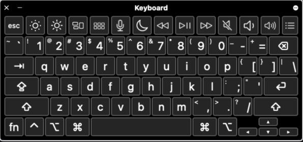
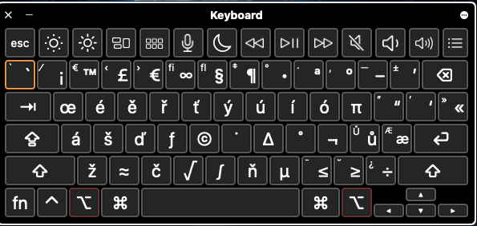
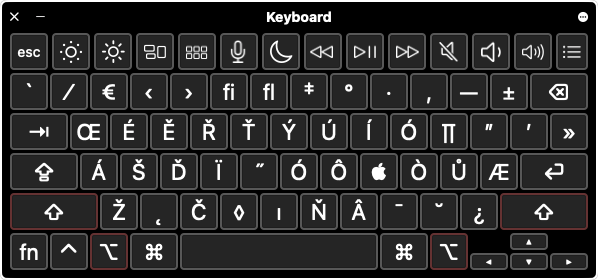

# 🇺🇸🇨🇿 US-Czech Hybrid Keyboard for macOS

 

**Stop switching input sources.**

This custom keyboard layout combines the standard **US QWERTY** layout (perfect for coding) with easy access to **Czech
diacritics** (č, ř, ž, ý...) via the `Option` key.

<p align="center">
  
</p>

## ✨ Features

* **Code-First:** Keeps the standard US layout for brackets `[]`, braces `{}`, slash `/`, and numbers, so your coding
  flow isn't interrupted.
* **Czech-Ready:** Type Czech characters instantly without switching keyboards.
* **System Integration:** Installs as a native macOS Bundle.
* **Dark Mode Compatible:** Includes a custom icon that looks great on the menu bar.

## 🍺 Installation (Homebrew)

The easiest way to install is via my custom Homebrew tap.

1. **Tap the repository:**

```bash
brew tap hammafataka/engczech-keyboard
```

2. **Install the Cask:**

```bash
brew install --cask us-czech-keyboard
```

**Note:** You will be asked for your password during installation. This is required because keyboard layouts must be
installed into the system folder (`/Library/Keyboard Layouts/`) to function on the login screen.

## ⚙️ Setup & Activation

After installing via Homebrew, macOS requires a few manual steps to register the new input source:

1. **Log out** and log back in (or restart your Mac). *This is required.*
2. Open **System Settings** → **Keyboard**.
3. Click **Edit...** next to "Input Sources".
4. Click the **+ (Plus)** button in the bottom left.
5. Scroll down to **English** (or search for "U.S. - Czech").
6. Select **U.S. - Czech** and click **Add**.
7. (Optional) Remove your old US or Czech layouts to avoid confusion.

## ⌨️ Cheatsheet / How to Use

The base layout is standard **US English**. To type Czech characters, hold the **Option (⌥)** key:

| Desired Character | Keystroke      |
|-------------------|----------------|
| **á**             | `Option` + `a` |
| **č**             | `Option` + `c` |
| **ď**             | `Option` + `d` |
| **é**             | `Option` + `e` |
| **ě**             | `Option` + `w` |
| **í**             | `Option` + `i` |
| **ň**             | `Option` + `n` |
| **ó**             | `Option` + `o` |
| **ř**             | `Option` + `r` |
| **š**             | `Option` + `s` |
| **ť**             | `Option` + `t` |
| **ú**             | `Option` + `u` |
| **ů**             | `Option` + `j` |
| **ý**             | `Option` + `y` |
| **ž**             | `Option` + `z` |


## Previews

### Layout without key

<p align="center">
  
</p>

### Layout with option key

<p align="center">
  
</p>

### Layout with shift+option key for capitalizing

<p align="center">
  
</p>

## 📦 Manual Installation

If you don't use Homebrew:

1. Download the latest release from the [Releases Page](https://github.com/hammafataka/homebrew-engczech-keyboard/releases/).
2. Unzip the file.
3. Move `U.S.-Czech.bundle` to `/Library/Keyboard Layouts/`.
4. Log out and log back in.
5. Add the input source via System Settings.

## 🗑 Uninstallation

To remove the keyboard layout:

```bash
brew uninstall us-czech-keyboard
```

Then go to **System Settings > Keyboard > Input Sources** and remove the entry.

---


**Enjoy coding efficiently!** 🚀

